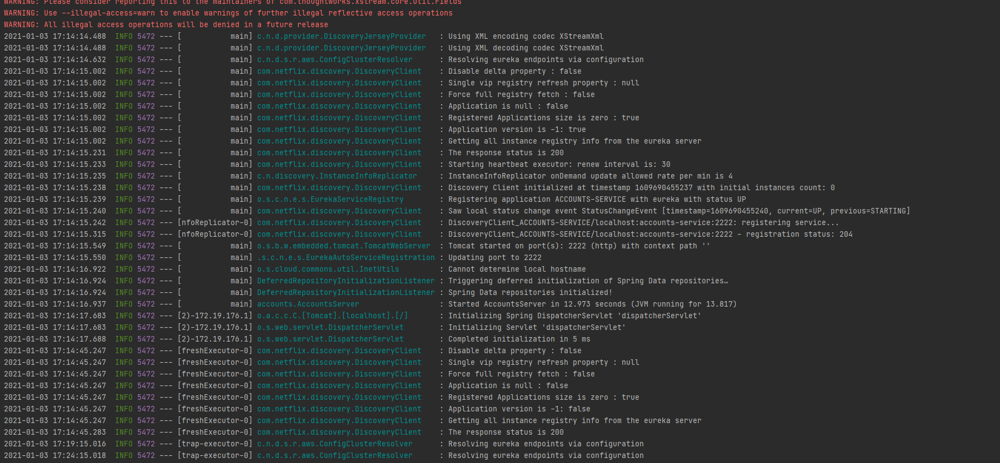
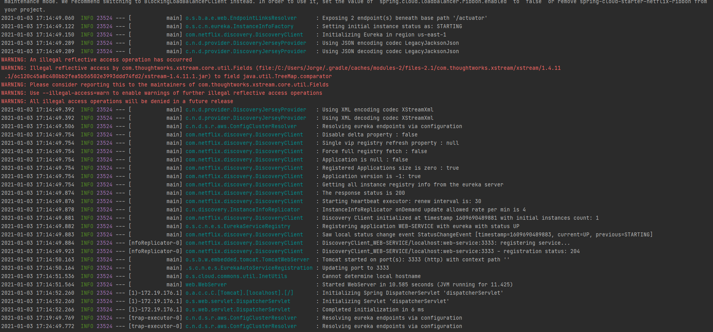
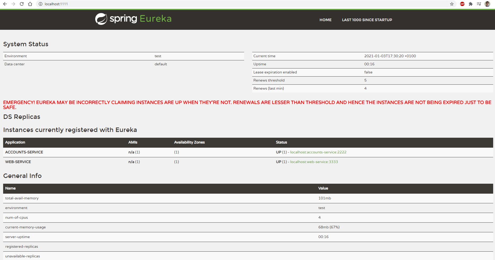
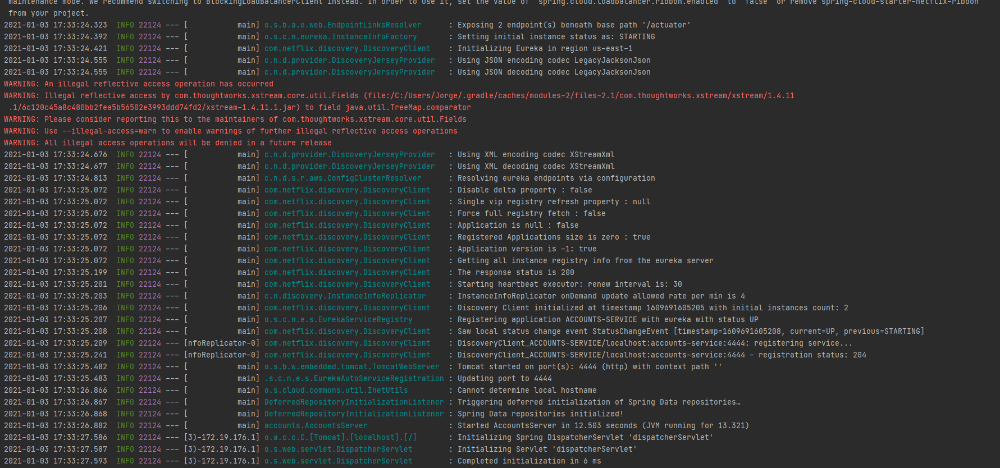
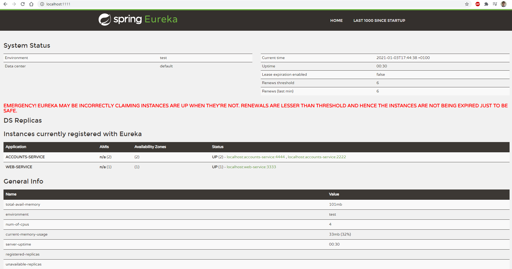

### **The two microservices are running and registered (two terminals, logs screenshots)**

- Accounts service log: 
- Web service log: 

### **The service registration service has the two microservices registered (a third terminal, dashboard screenshots)**

- Dashboard with two services running: 

### **A second account microservice is running in the port 4444 and it is registered (a fourth terminal, log screenshots)**

- Accounts2 in port 4444 log: 
- Dashboard with two account services running: 

### **A brief report describing what happens when you kill the microservice with port 2222. Can the web service provide information about the accounts? Why?**

During a short period of time, some request to the web service fails. I think it is because Eureka take some seconds to remove the service from its 
repository, the same as setting up a new one. After that, all is working fine.
